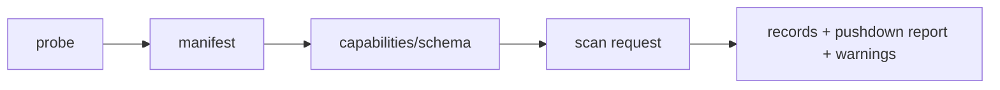

# AQL Adapter Contract v0

## 1. 目标

Adapter 将不稳定的 Agent 私有格式转换为稳定 Canonical Record。v0 只读，禁止任何修改源数据的方法。

## 2. 生命周期



### `probe`

- 输入显式 data root、OS 信息和发现策略。
- 只检查存在性、文件类型、schema/格式指纹。
- 不读取消息正文和工具 payload。
- 不创建目录、锁文件或缓存。

### `manifest`

- 列出 source kind、redacted locator、format fingerprint、watermark 和 capability。
- 同一 data root 中的 SQLite/index/rollout 是多个 physical source，共享一个 root identity。

### `scan`

- 只读取请求的 logical table 和 columns。
- 返回流式记录、下推报告、warning 和 snapshot 状态。
- 必须响应取消和预算耗尽。

## 3. 概念 Rust API

具体签名可在实现时按同步/异步选择微调，但语义不得改变。

```rust
pub trait AgentAdapter: Send + Sync {
    fn id(&self) -> &'static str;
    fn probe(&self, request: ProbeRequest) -> Result<ProbeResult, AdapterError>;
    fn capabilities(&self, manifest: &SourceManifest) -> Capabilities;
    fn schema(&self, manifest: &SourceManifest) -> AdapterSchema;
    fn scan(&self, request: ScanRequest) -> Result<ScanResult, AdapterError>;
}

pub struct ScanRequest {
    pub source: SourceManifest,
    pub table: TableName,
    pub projection: Vec<ColumnName>,
    pub predicates: Vec<Predicate>,
    pub limit: Option<u64>,
    pub order_hint: Vec<Ordering>,
    pub access: AccessGrant,
    pub budget: ResourceBudget,
    pub cancellation: CancellationToken,
    pub snapshot: Option<SnapshotToken>,
}

pub struct ScanResult {
    pub records: RecordStream,
    pub pushdown: PushdownReport,
    pub diagnostics: ScanDiagnostics,
    pub snapshot: SnapshotReport,
}
```

`ScanDiagnostics` 是与 `RecordStream` 共享的只读诊断句柄。Adapter 可以在惰性消费期间追加 warning；调用方必须在流结束、达到最终 limit 或因错误停止后读取诊断。诊断锁不可用时必须 fail closed，禁止静默丢弃兼容性或截断 warning。

`TableName` 包含 `Usage`、`SessionEdges` 和 `Artifacts`。Adapter 必须显式声明 capability；不支持的表返回 unsupported 错误，禁止映射到其他表或返回伪造空结果。`Usage` 通常由 canonical 派生 provider 实现；`SessionEdges`/`Artifacts` 只有来源存在已验证 contract 时才由 Adapter 提供。

Adapter 可以提供来源明确记录的 `Usage` facts；engine 将其与 derived message/tool facts UNION，而不是覆盖或猜测 NULL token。缺少该 capability 的来源不扫描该内部 provider。

Codex `Artifacts` 的 contract 采用表级 Path gate：Adapter 在打开 rollout 前检查 `request.access.path`，即使 projection 只包含 Safe 字段也必须拒绝未授权请求。Path grant 只允许枚举明确的 `patch_apply_end.changes` key；读取 `content`、`unified_diff` 或构造 `content_json` 仍要求 Content。Adapter 绝不打开 key 指向的文件。

## 4. Projection

- Projection 为空表示零列扫描/计数意图，不表示 `*`。
- Planner 必须在调用 Adapter 前展开 safe `*`。
- Adapter 不得读取未请求的 Path/Content/ToolInput/ToolOutput 字段。
- 为解析记录结构必须读取的 framing bytes 不算读取字段内容，但不得保留/输出 payload。
- Adapter 返回的每条 record 字段集合必须是 projection 的子集加内部 identity/provenance 字段。

## 5. Predicate 下推

v0 支持的通用 Predicate 子集：

- `Eq(column, literal)`
- `In(column, literals)`
- `Range(column, lower, upper)`
- `IsNull(column)`
- `And(predicates)`

Adapter 对每个 predicate 返回：

- `Exact`：完全执行，engine 无需重算。
- `Inexact`：用于减少扫描，但 engine 必须重算。
- `Unsupported`：未执行。

禁止把 Unsupported 当作已过滤。文本 LIKE/regex 在 v0 默认由 engine 处理，除非来源明确支持。

## 6. Limit 与排序

- `limit` 只有在不会改变 SQL 语义时才能下推。
- 存在 engine-side filter/order 时，Adapter 不得把最终 LIMIT 错误地下推为原始读取上限。
- Adapter 可接受 `scan_hint_limit` 作为批大小优化，但不得将其报告为 Exact SQL Limit。
- `order_hint` 只表示偏好；只有来源能保证完整顺序时才报告 Exact。

## 7. Access Grant

```rust
pub struct AccessGrant {
    pub path: bool,
    pub content: bool,
    pub tool_input: bool,
    pub tool_output: bool,
}
```

- Secret 永不授权。
- Path 需要 `--access path`，不能因为字段存放在 metadata DB 中就视为 Safe。
- projection 含未授权字段时，`scan` 在打开 heavy source 前返回 `AccessDenied`。
- 授权仅对当前命令有效，不持久化为全局默认。
- Adapter 不自行根据 TTY、用户身份或输出格式猜测授权。

## 8. Resource Budget

最低字段：

```rust
pub struct ResourceBudget {
    pub max_records: u64,
    pub max_bytes_read: u64,
    pub max_output_bytes: u64,
    pub deadline: Option<Instant>,
}
```

语义：

- 每读取一批数据更新计数。
- 预计单条记录会突破预算时，在读取 payload 前尽量拒绝。
- 达到预算返回结构化 `BudgetExceeded`，包含实际计数，不返回看似完整的部分结果；partial mode 不属于产品契约。
- 取消优先级高于预算错误。

## 9. Snapshot 与 Watermark

- SQLite watermark 可由 schema version、数据库标识和只读事务快照信息构成，不能只用 mtime。
- JSONL watermark 至少包含文件 identity、size 和安全时间信息。
- scan 开始与结束检查 watermark。
- 查询内缓存的解析结果在 replay 结束时必须对该文件重查 identity 与长度（对齐 scan-end watermark 检查），失配返回 `SnapshotUnavailable`。
- 变化时查询可返回 `StaleSnapshot` warning；Catalog 不得声称 strong consistency。
- 查询不会把 weak snapshot 表述为 strong consistency；发生变化时必须返回 sanitized warning 或失败。

## 10. 错误模型

错误类别：

- `NotFound`
- `PermissionDenied`
- `UnsupportedFormat`
- `CorruptSource`
- `AccessDenied`
- `BudgetExceeded`
- `Cancelled`
- `SnapshotUnavailable`
- `InternalAdapterError`

Warning 类别：

- `UnknownEvent`
- `UnknownField`
- `TruncatedRecord`
- `FieldConflict`
- `StaleSnapshot`
- `IncompleteCapability`

错误必须含 agent/source/table/stage，但不得含正文、tool payload 或未脱敏绝对路径。

## 11. 文件访问可观察性

为验证 projection 和 access，测试构建应支持 `FileAccessObserver`：

```rust
pub trait FileAccessObserver {
    fn opened(&self, source_kind: SourceKind, access: OpenAccess);
    fn bytes_read(&self, source_kind: SourceKind, count: u64);
}
```

它只用于指标和测试，不记录真实路径或内容。

## 12. Capability

每个 Adapter/manifest 声明：

- 支持的 logical tables/columns。
- 字段 AccessClass/Cost。
- Predicate 类型。
- 是否支持精确 Limit/Order。
- snapshot strength：none/weak/strong。
- 可识别的 format fingerprints。

Capability 是运行时事实，不由 Agent 名硬编码推断。

## 13. Contract Test Suite

所有 Adapter 必须通过：

1. Probe 不创建或修改文件。
2. Safe metadata projection 不读取 Path/Content 字段，也不打开 content source。
3. 未授权字段在读取前失败。
4. Unsupported predicate 被 engine 重算。
5. Limit 不在语义不安全时下推。
6. Budget 和 cancellation 可终止 scan。
7. 未知事件 warning 后继续。
8. 截断最后一行不丢弃前面记录。
9. Error 不泄露路径/正文。
10. 相同 snapshot 输入产生稳定逻辑顺序。

## 14. v0 明确不包含

- 写操作。
- 动态第三方插件加载。
- 网络数据源。
- 增量订阅/watch。
- 跨查询或持久化的 Adapter 缓存。查询生命周期内、随 Adapter 实例释放的有界解析缓存不在此列（见 `docs/adr/0002-single-pass-scan.md`）。
- 向量或语义搜索。

## 15. Multi-source and Kimi requirements

- CLI 在任何 Adapter probe 前解析配置数据库的全部 member，并拒绝 unknown、重复、重叠和无效组合。
- 每个 `FederatedSource` 永久绑定产生 manifest 的 Adapter；engine/catalog 不按 Agent 名分支。
- Kimi 只允许 index、state 和 state-declared wire 三类路径。root、sessions、bucket、session、agents、agent 和最终文件均 no-follow/revalidate。
- state 中未授权 title/lastPrompt/workDir/homedir 不得进入 diagnostics。workDir bucket 校验以流式 JSON string decode + SHA-256 完成，不保留完整 Path。
- wire 每个文件在打开时固定长度；完整 malformed record 失败，最后不完整 record warning，后续 append 留到下次 scan。
- main 优先、其余 agent ID lexical order；subagent identity 由 session ID + explicit agent ID 构成，parentage 只取 `parentAgentId`。
- 任一 predicate 非 Exact 时最终 LIMIT 不得提前应用。所有 source 共享同一 budget、deadline 和 cancellation token。
- stdout 查询必须事务发布；`query --output-file` 使用原子 no-replace。任一来源失败不得发布成功外观的部分结果。

## 16. OpenCode 与多源联邦要求

- OpenCode source 只允许打开根目录及 `opencode.db`、已有 `opencode.db-wal`、`opencode.db-shm`；logs、repos、config、plugins、project tree 和任意 sibling 数据文件不属于 discovery。
- SQLite 必须 read-only/query-only，禁用 checkpoint-on-close、trusted schema、trigger/view/DQS 和 writable schema，并安装 fixed-statement authorizer。credential/account/control/permission 等共址表、ATTACH/DETACH、DDL/DML、temp write、unsafe pragma 和未知函数必须可观察地拒绝。
- root、DB、WAL、SHM 均拒绝 symlink/type drift，并在 probe/scan 前后验证 identity。活跃 WAL 必须纳入一致读取；不得使用会遗漏 WAL 的 immutable shortcut，不得 migrate/checkpoint/copy/repair。
- schema contract 固定到 OpenCode 1.17.18 的 38 migration 和 `message` + `part` 公共读取投影。`session_message`、`event`、`event_sequence` 不得 UNION 或按时间/文本猜测去重。
- Safe session SQL 只能投影所需 Safe 列。title 是 Content，directory/path 是 Path；message/part JSON 只有明确 canonical 列与对应 grant 时才可 SELECT/parse，并在敏感字符串分配前检查长度。
- session identity、archive、parent edge、message/part order、tool correlation 和 usage 只使用 pinned explicit fields。reasoning/file/patch/subtask/todo/permission/share/account/credential/arbitrary event 保持 unsupported。
- Codex、Kimi、OpenCode 的 manifest 永久绑定各自 Adapter，但执行共享同一个 authorized LogicalPlan、budget、deadline 和 cancellation token。任一来源失败时 query 不得发布部分结果。

## 17. Claude Code 与四源联邦要求

- Claude Code root 只允许固定深度打开 `projects/<project>/<session-uuid>.jsonl` 和同级 `agent-<safe-id>.jsonl`。auth、settings、plugins、hooks、logs、memory、file-history payload 和项目文件不属于 source。
- Main filename UUID 必须与 identity-bearing record 的 `sessionId` 一致。Agent transcript 的 `agentId` 必须与文件名一致，`sessionId` 必须指向同 project 目录的 main transcript；child identity 使用 main session + agent ID namespace。
- `user`/`assistant` 顶层 UUID 是 message identity。Content 只接受 text/thinking；tool input/output 只能分别进入 ToolInput/ToolOutput 字段，禁止经 `messages.content_json` 降级泄露。
- Claude 可能为一个 API message 写入多个连续 assistant entry，并重复 usage。消息按顶层 UUID保留，usage 只按显式 API message ID 记一次。
- Transcript 在打开时固定长度；append 留到下次扫描，identity 改变或长度缩短失败。完整 malformed record 失败，最后 incomplete record warning，unknown event 保持 opaque warning。
- Claude、Codex、Kimi、OpenCode 的 manifest 永久绑定各自 Adapter，四源执行继续共享同一 authorized LogicalPlan、budget、deadline、cancellation 和 transactional publication。
