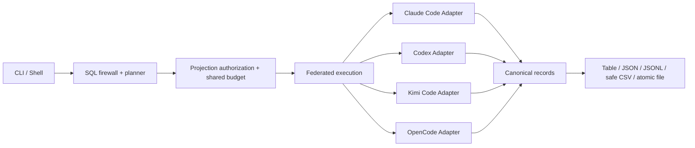

# AQL 架构

AQL 将不同 Agent 的本机格式映射为统一、只读的 canonical tables。SQL engine 不依赖具体文件布局，CLI 只公开 database 和 SELECT。



## Canonical model

`aql-model` 定义稳定记录、逻辑 ID、provenance 和访问级别。公开表为：

```text
agents sessions messages tool_calls usage session_edges artifacts
```

除 Agent 数据表外，AQL 还提供只读元数据表 `aql_tables`、`aql_columns`、`aql_sources` 和 `aql_capabilities`；用户不会查询 Agent 私有表、JSON key 或文件结构。

## Adapter API

`aql-adapter-api` 定义 bounded probe、source manifest、projection/predicate/limit/order scan、共享预算、cancellation、snapshot 和结构化 diagnostics。

Adapter 只读取固定格式白名单。未知格式或无法证明安全兼容的漂移必须 fail closed。

## Agent adapters

- `aql-adapter-claude-code`：固定深度 transcript JSONL。
- `aql-adapter-codex`：SQLite/session index/rollout JSONL。
- `aql-adapter-kimi-code`：session index、state 和 state-declared wire JSONL。
- `aql-adapter-opencode`：pinned SQLite schema 和 active WAL snapshot。

认证、配置、日志、插件和项目树不属于 source。

## Catalog 与 federation

`aql-catalog` 处理同一逻辑会话的来源和冲突。每个 `FederatedSource` 永久绑定产生 manifest 的 Adapter。

一次查询的全部来源共享：

- 一个授权后的 logical plan；
- 一个 records/read/output budget；
- 一个 deadline；
- 一个 cancellation token；
- 一次完整结果发布。

任一来源失败时不发布部分结果。

## SQL engine

`aql-engine-datafusion` 在 DataFusion 之前执行固定 firewall：

- 恰好一条 SELECT/CTE 或 EXPLAIN SELECT；`SHOW TABLES` 和 `DESCRIBE/DESC` 在进入同一查询管线前重写为元数据 SELECT；
- 只允许 canonical tables；
- 固定函数白名单；
- AST complexity limits；
- Safe wildcard rewrite；
- column-lineage access enforcement；
- conservative projection/predicate/limit/order pushdown。

SQL 永远不是 mutation language。

## CLI 和 database

公开选择形式只有 `database` 与 `-d`：

- `claude`、`codex`、`kimi`、`opencode` 映射固定候选；
- `all` 显式检查并联合兼容候选；
- 配置数据库由 `aql-config` 的 `aql-databases-v1` 存储；
- 配置数据库与内置数据库同名时，配置数据库优先。

Shell 的 SHOW/USE/GRANT 控制语句由 CLI 处理；SHOW TABLES、DESCRIBE/DESC、SELECT 和 EXPLAIN 进入同一 query path。`--file` 只接受单查询 `.aql` 文件。

## 输出

查询批次流式渲染到匿名、无路径的 private 临时文件，只有数据流完整到达 EOF、元数据完成且渲染成功后才顺序发布 stdout。表格渲染使用第二个匿名行缓冲完成全局列宽计算，不保留全部 Arrow 批次。`--output-file` 直接流式写入同目录 private 临时文件，完成后 fsync、校验目录 identity 未变化，并通过 no-replace rename 发布；这些 nofollow 打开、mode、identity 校验与原子 rename/sync 原语由 `aql-fs` 提供。目标已存在、目录被替换或任一步失败时，不发布结果。

CSV 只有安全模式，公式形状文本始终转义。

## Config 和 installation state

`aql-config` 只保存配置数据库名称、Adapter ID 和绝对 member path。配置 schema 为 `aql-databases-v1`。配置写入经 `aql-fs` 原语完成：private 临时文件 fsync、原子 rename 和目录 sync。

installation salt 用于 installation-scoped identity 与 redaction，其创建同样使用 `aql-fs` 的 no-replace 发布。普通查询不创建结果缓存或 Agent source sidecar。

## 核心执行顺序

```text
parse and validate SQL
  → authorize requested columns
  → validate output target when requested
  → resolve explicit database
  → probe and bind adapters
  → execute under one shared budget
  → render and publish complete output
```

因此，非法 SQL、未授权字段和不安全输出目标必须在敏感 source read 之前失败。

## 测试与发布

`aql-test-support` 生成确定性的四种 Agent 合成 fixture。`aql-release` 负责确定性 archive、验证、安装、卸载和 Formula。`cargo xtask verify` 串联 workspace、文档、release gates，并重跑性能相关的行为测试（懒流式读取、预算与取消语义）；这些 gate 只做行为断言，不含计时或吞吐指标。

相关契约：

- [Canonical Schema](canonical-schema-v0.md)
- [Adapter Contract](adapter-contract-v0.md)
- [Query Engine ADR](adr/0001-query-engine.md)
- [隐私与威胁模型](privacy-threat-model.md)
- [兼容性](compatibility.md)
