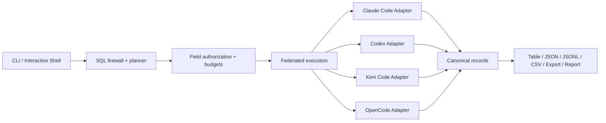

# AQL 架构概览

AQL 将不同 Agent 的私有本机格式映射为统一、只读的 canonical tables。SQL engine 永远不直接依赖某个 Agent 的文件布局。



## 分层

### Canonical model

`aql-model` 定义稳定记录、逻辑 ID、provenance 和访问级别。用户查询的是 `agents`、`sessions`、`messages`、`tool_calls`、`usage`、`session_edges`、`artifacts`，而不是 Agent 的原始表或 JSON key。

### Adapter API

`aql-adapter-api` 定义：

- bounded probe；
- source manifest 和 capability；
- projection/predicate/limit/order scan request；
- shared resource budget；
- cancellation 和 snapshot；
- structured diagnostics。

Adapter 只允许读取固定格式白名单。格式未知或漂移时 fail closed，或者在有明确兼容规则时降级并产生 warning。

### Agent adapters

- `aql-adapter-claude-code`：只读 `~/.claude/projects` 中的固定深度 transcript JSONL。
- `aql-adapter-codex`：只读 SQLite/session index/rollout JSONL。
- `aql-adapter-kimi-code`：只读 session index、state 和 declared wire JSONL。
- `aql-adapter-opencode`：只读 pinned SQLite schema 和 active WAL snapshot。

每个 Adapter 负责格式验证、身份、字段来源、按需解析、文件边界和敏感值上限。Agent auth/config/log/plugin/project tree 不属于 source。

### Catalog and federation

`aql-catalog` 处理同一逻辑实体的来源和冲突。查询 engine 中每个 `FederatedSource` 永久绑定产生 manifest 的 Adapter。

跨来源查询共享：

- 一个 authorized logical plan；
- 一个 records/read/output budget；
- 一个 deadline；
- 一个 cancellation token；
- 事务式结果发布。

任一来源失败时，不发布看似完整的部分结果。

### SQL engine

`aql-engine-datafusion` 使用 GenericDialect parser 和 DataFusion execution，但先执行固定 SQL firewall：

- 恰好一条只读 query；
- 只允许 canonical tables/CTE；
- 固定函数白名单；
- AST complexity limits；
- safe wildcard rewrite；
- column lineage access enforcement；
- projection/predicate/limit/order conservative pushdown。

### CLI and database model

`aql` 将用户看到的 database 映射为内部 source 集合：

- 保存的同名 database 优先；
- `claude`、`codex`、`kimi`、`opencode` 对应固定 candidate；
- `all` 显式选择所有兼容的固定 candidate。

Shell 控制语句由 CLI 处理；SELECT 仍进入同一 SQL engine，不存在第二查询路径。

### Config and state

- `aql-config`：private configured databases，只保存 adapter 和绝对 source path；内部配置 schema 为兼容性继续沿用 profile 命名。
- `aql-index`：显式 opt-in 的 AQL-owned metadata/content index。
- installation salt：用于 installation-scoped opaque identity/redaction。
- Action state：与 read path 分离的 authenticated plan/audit/store。

所有持久化目录使用 private permissions、no-follow/identity validation、writer lock、fsync 和 atomic publication。普通查询不在 Agent source 旁写 sidecar。

### Actions

SQL 永远不是 mutation language。`aql-actions` 定义 capability negotiation、plan、完整 digest confirmation、expected revision、idempotency/outcome、audit 和 reconciliation。

Claude Code、Codex、Kimi Code 和 OpenCode 当前均未达到 production Action admission 条件，对应 production Action adapters 没有 writer。`aql-action-synthetic` 只用于隔离的确定性协议测试。

### 测试与发布工具

`aql-test-support` 生成确定性的合成 Claude Code、Codex、Kimi Code、OpenCode 和 Action 数据；它只作为 dev/tool dependency，不进入生产 CLI。`aql-release` 负责本地确定性归档、校验、安装、卸载和 Homebrew formula 生成。`cargo xtask` 是 fixture、能力验证和显式授权 real smoke 的统一入口。

## 安全模型

核心顺序：

```text
parse and validate SQL
  -> authorize requested columns
  -> resolve explicit database/source
  -> probe and bind adapters
  -> execute under shared budgets
  -> publish only complete output
```

因此，未授权字段、未知表、非法 SQL 和 source selection ambiguity 必须在敏感 source read 之前失败。

完整契约见：

- [Canonical Schema](canonical-schema-v0.md)
- [Adapter Contract](adapter-contract-v0.md)
- [Query Engine ADR](adr/0001-query-engine.md)
- [隐私与威胁模型](privacy-threat-model.md)
- [兼容性矩阵](compatibility.md)
