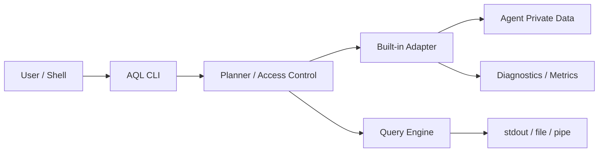

# AQL Phase 0/1 隐私与威胁模型

## 1. 安全目标

AQL 查询的是高度敏感的本机 Agent 数据。Phase 0 的安全目标是：即使实现不完整、来源格式未知或查询失败，也不修改原始数据、不越权读取正文、不把敏感内容写入仓库/日志，并限制恶意或意外查询消耗的本机资源。

## 2. 保护资产

- 用户和 Agent 的消息正文、reasoning。
- 工具参数、shell command、环境变量和工具输出。
- 源码、patch、文件内容和附件。
- API key、OAuth token、cookie、auth/config。
- 本机用户名、绝对路径、邮箱、项目名称。
- 会话标题、preview 和首条用户消息。
- Agent 原始 SQLite/JSONL 的完整性。
- 查询历史、导出文件和本地索引。

## 3. 信任边界



- Agent 私有数据是不可信输入：可能损坏、截断或被恶意构造。
- SQL 是用户输入，可能请求大量数据或敏感字段。
- stdout 下游也不可信，可能是文件、管道或外部进程。
- Built-in Adapter 在 Phase 0 受信；第三方动态插件不受支持。
- 查询引擎依赖是供应链边界。

## 4. 攻击者与失败模式

### A1：意外敏感查询

用户使用 `SELECT *` 或复制示例时意外导出正文。

控制：safe `*`、title=Content、cwd/project=Path、列级 AccessClass、显式 `--access`、读取前拒绝。

### A2：SQL 绕过授权

通过 alias、function、subquery、hidden selection、ORDER BY sensitive column 等间接引用敏感列。

控制：授权基于完整 logical plan 的所有 referenced columns，而不是最终 projection；执行前统一检查。

### A3：日志泄露

错误、debug log 或 query history 记录 SQL、路径和内容。

控制：默认不保存完整 SQL；错误使用 redacted locator；禁止 record debug dump；测试错误文本。

### A4：读取 auth/config

宽泛目录扫描把 `auth.json` 等当普通 JSON 数据。

控制：source allowlist；明确 denylist；Adapter 只打开 manifest 声明的数据文件。Claude Code 只允许固定深度的 `projects/<project>/{UUID,agent-ID}.jsonl`，不会读取同根目录的 auth/settings/plugins/memory/logs。

### A5：路径穿越与 symlink

恶意 fixture/data root 让 Adapter 打开根目录外文件。

控制：规范化 root、拒绝逃逸、检查 symlink policy、open 前验证。

### A6：资源耗尽

大 JSONL、工具输出、笛卡尔 JOIN 或 regex 占满内存/CPU/磁盘。

控制：records/bytes/output/deadline 预算、取消、safe defaults、Phase 0 限制 JOIN/复杂功能、无隐式索引。

### A7：源数据损坏

错误 SQLite mode、误写 fixture path、未来 Action 接线导致修改原始 DB。

控制：Adapter Contract v0 无写接口；SQLite read-only；文件权限测试；执行前后 source hash/metadata 对比。

### A8：格式混淆

未知 schema 被旧解析器错误解释，造成错误合并或泄密。

控制：format fingerprint、关键字段缺失即 Unsupported、未知字段宽松但不提升权限。

### A9：身份误合并

按 title/cwd 猜测合并不同 session，导致查询或未来操作影响错误对象。

控制：只用明确 native ID namespace；不确定时保持重复并标记 unknown。

### A10：供应链/插件执行

第三方 Adapter 或依赖执行恶意代码。

控制：Phase 0 只编译内置 Adapter；锁定依赖；审计新增依赖；禁止动态库/脚本插件。

### A11：输出端泄露

用户授权在终端查看内容，但命令实际被重定向或 shell history 保存。

控制：授权始终有效但在非 TTY 输出 sensitive 字段时额外 warning；文档提示 shell history 风险。不能因为是 TTY 就自动授权。

### A12：TOCTOU 与活跃 WAL

查询期间文件变化导致混合快照或读取半条记录。

控制：SQLite read transaction、watermark、JSONL 截断行容错、stale snapshot warning。

## 5. 默认策略

| 项目 | 默认 |
|---|---|
| 网络 | 禁止/不需要 |
| 遥测 | 无 |
| Agent 原始数据 | 只读 |
| `SELECT *` | 仅 Safe 字段 |
| Path | 拒绝，需 `--access path` |
| Content | 拒绝，需 `--access content` |
| Tool input | 拒绝，需 `--access tool-input` |
| Tool output | 拒绝，需 `--access tool-output` |
| Secret | 永不通过通用查询暴露 |
| SQL history | 不持久化 |
| 本地索引 | Phase 0 不存在 |
| 第三方 Adapter | 禁止 |
| Query timeout | 开启 |
| Scan/output budget | 开启 |

## 6. 敏感列授权检查

Planner 必须收集 logical plan 中所有列引用，包括：

- projection
- filter
- join predicate
- group/order/window
- function arguments
- hidden/internal selection

只要任一位置引用 Path 或敏感列，就要求对应 grant。不能仅检查最终输出列，因为 `WHERE content LIKE ...` 已经读取正文，`GROUP BY cwd` 也已经读取路径。

## 7. 日志和诊断规范

允许记录：

- error category。
- agent ID、source kind、table、stage。
- redacted source token。
- records/bytes/time。
- query fingerprint，不是完整 SQL。

禁止记录：

- record Debug 输出。
- 完整 SQL。
- literal value。
- 绝对路径。
- SQLite row/JSON line。
- tool name 以外的参数/输出。

错误示例：

```text
AccessDenied: table=messages column=content required=content stage=plan
```

禁止示例：

```text
Failed parsing <USER_HOME>/... line={"content":"secret..."}
```

## 8. Fixture 安全

- 使用明显合成身份：`Example User`、`/workspace/example`。
- 合成 token 使用不匹配真实 key 格式的占位符。
- 不从真实数据做“替换名字后提交”，因为正文仍可能包含秘密。
- 生成器 seed 固定。
- CI 扫描绝对路径前缀、常见 key 模式、邮箱和高熵字符串。
- Fixture 中若需要 secret 测试，使用专门的无效格式并在 manifest 标注。

## 9. Phase 0 验证清单

- [ ] Adapter API 没有 write/delete/update 方法。
- [ ] SQLite 连接为 read-only。
- [ ] Safe metadata 查询不读取 Path/Content 字段，content source opens = 0。
- [ ] 未授权 sensitive 查询 source opens = 0。
- [ ] auth/config 永不进入 manifest。
- [ ] symlink/path traversal fixture 被拒绝。
- [ ] 错误和 warning 不含敏感值。
- [ ] query timeout、budget、cancel 生效。
- [ ] stdout 关闭后停止上游扫描。
- [ ] 执行前后真实 source 的只读完整性检查一致。
- [ ] 仓库 secret/absolute path scan 通过。

## 10. 已接受风险

Phase 0 可接受：

- weak snapshot 导致查询带 `stale_snapshot` warning。
- 某些字段无法提供而为 NULL。
- 未知事件被跳过。
- 不提供全文搜索。

不可接受：

- 未授权读取正文后再丢弃。
- 为兼容未知格式读取 auth/config。
- 静默返回可能错误的合并结果。
- 预算耗尽时返回看似完整的结果。
- 修改原始 Agent 数据。

## 11. 后续阶段重新评审点

加入以下能力前必须更新威胁模型：

- Action/写操作。
- 本地全文索引。
- 第三方 Adapter/plugin。
- 网络或远程 Agent 数据源。
- GUI/服务端 API。
- 云端模型分析或同步。
- 跨 Agent 导入/恢复。

## 12. Phase 1 新增控制与复审

Phase 1 已增加：

- SQL AST 单语句只读 allowlist；DDL/DML/COPY/外部表/文件/URL/table function 在 probe 前拒绝。
- safe wildcard rewrite 和优化后 LogicalPlan source-column lineage 授权；执行同一份已审计计划。
- parser/planner 长度、深度、CTE、JOIN、表达式和 plan-node 固定上限。
- 全查询共享 records/read/output 计数，不能通过 JOIN、manifest 或 partition 复制额度。
- 256 MiB DataFusion GreedyMemoryPool；DiskManager 禁用，不产生 spill。
- 16 MiB 单敏感值、64 MiB 输出和默认 30 秒 deadline。
- typed JSON/JSONL，warning/metadata 与 stdout 分离。
- 格式 fingerprint 包含去敏 schema、SQLite user_version、index/rollout presence；关键 identity 缺失即拒绝。
- JSONL 固定扫描起始 byte boundary，追加内容留到下一次查询，半行产生 warning。
- source tree 不可写 fixture 仍可执行静态 SQLite 查询。

### 12.1 活跃 WAL 与 SHM reader marks

合成测试证实：SQLite `SQLITE_OPEN_READ_ONLY` 查询活跃 WAL 时不会修改主 DB、WAL 或业务数据，但 SQLite 会修改 writer 已创建的 `-shm` reader marks。用户已明确允许这一 SQLite 协调行为，以换取对未 checkpoint WAL 的正确可见性。

固定边界：

- 仅允许 SQLite 修改既有 `-shm` 的 reader coordination 状态。
- 主 DB 与 WAL 必须保持字节不变，AQL 不得创建 journal、WAL、SHM 或 cache sidecar。
- 不把 SHM reader marks 解释为 Agent 业务数据，也不承诺其字节稳定。
- 不自行复制可能包含未授权字段的完整 DB/WAL/SHM。
- 不使用 `immutable=1` 忽略未 checkpoint 的 WAL。

## 13. Phase 3 导出与派生分析复审

Phase 3 增加以下控制：

- `usage` 和报告通过静态 canonical schema、LogicalPlan lineage 与共享预算执行，不存在 CLI 私有扫描路径。
- REDACT、HMAC、截断、聚合和 MASK_PATH 不降低输入字段原有 AccessClass。
- portable JSON 逐 RecordBatch 编码；数字、布尔、NULL、JSON 和 timestamp 保持类型。
- Markdown 表格对 pipe、换行、控制字符、反斜杠和反引号 fence 做有界转义；未知值显示为 `unknown`。
- stdout 的 broken pipe 会取消上游；timeout、SIGINT 和 output budget 传播到同一 cancellation token。
- 文件导出使用目标目录 descriptor、no-follow 检查、同目录 `0600` 临时文件、flush/sync、目录与目标 identity 复验及原子 rename；失败路径删除临时文件。
- 文件发布只使用原子 no-replace；用户确认移除覆盖模式，因此不存在复验旧 inode 后再替换的 compare-and-swap 竞态。
- `report summary` 仅引用 Safe 字段；`report project` 在 planner 阶段要求 Path grant，并且只输出 MASK_PATH 后的标签。
- artifacts 不扫描项目文件系统，也不打开 artifact path。用户确认整张表要求 Path grant；正文/diff 仍额外要求 Content，未投影正文时 parser 会跳过 payload。

## 14. Phase 4 可选索引威胁模型

Phase 4 把 AQL-owned index 引入新的持久化信任边界：

- 默认 query/report/doctor 不创建索引。metadata/content generation 只能由显式 index 命令创建。
- metadata generation 只保存 Safe allowlist、去敏 identity/fingerprint/watermark；不保存 root、SQL、Path、Content、ToolInput、ToolOutput 或 Secret。
- content generation 是明文敏感副本。每次 build/update 都要求 Content grant 和固定持久化确认；0600 不是加密，备份/同步软件和特权账户仍可能复制它。
- search hit、rank、count、term frequency、highlight 和 snippet 均继承 Content，不因 tokenization/aggregation 降级。
- AQL state root 与 Agent data root 相同、identity 相同或互为 ancestor/descendant 时拒绝写入。
- index root 使用 ownership marker、0700/0600、directory fd/no-follow 和 identity 复验；symlink/目录替换/权限异常 fail closed。
- build/update 使用不可见 building generation 和 transactionally published active generation。失败、取消或磁盘不足保留旧 active generation。
- clear 不接受 path。单来源使用 catalog 中的 opaque source_id；全清需要独立 acknowledgement；未知文件或 marker 不匹配时拒绝。
- FTS query 使用固定 grammar 和参数绑定。FTS5 不可用时明确失败，不静默全量扫描 Agent source。
- stale/incompatible generation 不得返回看似完整的新鲜结果；任何 allow-stale 模式必须显式 warning。
- 删除/VACUUM/`secure_delete` 不承诺 SSD、备份或 copy-on-write 文件系统的法证擦除。

## 15. Phase 5 Action 威胁模型

Phase 5 首次允许显式 Action，但不允许私有 Agent 存储写入。新增主要威胁与控制：

- **Confused deputy / wrong target**：plan 绑定 opaque source/entity、operation、capability version、expected revision 和完整 HMAC digest；不接受 native ID、SQL 或 path 作为写目标。
- **Stale write / TOCTOU**：production capability 必须由官方通道原子执行 expected revision/CAS。单独 preflight 后无条件写入不被支持。
- **Replay / duplicate effect**：每个 plan 绑定 action/idempotency ID 且只能进入一次 durable intent；官方 idempotency 或 authoritative outcome lookup 是准入条件。
- **Lost response / crash ambiguity**：dispatch 后 timeout、crash 或 outcome audit 失败一律成为 `unknown_outcome`，阻止盲目 retry；reconcile 只能查询官方结果。
- **Interrupted audit append**：完整 audit record 必须通过精确字段、sequence、previous commitment 与 HMAC 验证。只有持有 root writer lock 的 apply/reconcile 可以删除一个短的、无换行末尾残片，且删除前必须验证全部完整前缀；带换行的无效记录、未知字段和 HMAC 失败一律视为篡改。
- **Confirmation substitution**：apply 要求完整 plan digest，拒绝 prefix、`--yes`、复用 confirmation 和隐式 prompt。
- **Sensitive rename leakage**：新旧 title 都是 Content。plan/audit 只保存 keyed commitment/长度，不记录 plaintext、native ID、stderr/stdout 或环境。
- **Audit gap/tampering**：intent 在 dispatch 前 fsync；outcome 在 response 后 fsync；audit record 形成 HMAC chain。pre-dispatch audit failure 禁止写，post-dispatch failure 进入 unknown outcome。
- **Command injection**：若未来官方 channel 是 CLI，只允许固定 executable/argv、无 shell、sanitized environment 和 bounded/discarded output；不暴露 executable/template 参数。
- **Plan/audit filesystem attack**：0700/0600、ownership marker、directory-fd/no-follow、root identity revalidation、advisory lock；unknown file/symlink/permission drift fail closed。
- **False reversibility**：只有官方 inverse operation 和安全 prior-state handling 同时存在才宣称 reversible。rollback 是新 plan，必须重新校验 revision。
- **Deadline/cancellation confusion**：dispatch 前 deadline/终止不得产生外部效果；dispatch 后终止留下的 `executing` 对外等价于 `unknown_outcome`，只能通过权威 outcome lookup 收敛。已知的迟到结果仍需持久化，不能因“超时”改写为未执行。

截至 2026-07-12，Codex CLI 0.144.1 的 archive/unarchive 与 experimental app-server archive/unarchive/name-set 均未提供 Action expected revision/CAS，也未提供满足 crash recovery 的 Action idempotency/outcome contract，因此 production Codex Actions 固定为 unsupported。AQL 不调用这些写命令，也不回退到私有数据库写入。

## 16. Phase 6 Kimi 与联邦查询威胁模型

- Kimi root 与 credentials/OAuth/config/logs/plans/tasks 共址，因此 discovery 使用精确 allowlist，禁止递归“识别所有 JSON”。
- root 到最终 state/wire 的每个目录组件都拒绝 symlink，并在读取前后验证 identity；中间目录 symlink fixture 必须失败。
- Safe session 查询可物理读取有界 state bytes，但未授权 Content/Path 通过 RawValue skip；敏感字符串在分配前检查上界。workDir authority 用流式 decoder/hash 校验，不保留路径。
- 缺少 workDir/custom.cwd 不丢弃显式 session identity，而是 cwd NULL + fixed warning；存在但与 bucket hash 冲突属于 corruption。
- wire record 上限 1 MiB，文件长度在 open 时固定。LIMIT/drop/cancel 不打开后续 agent/session；未知事件 warning；完整 malformed 失败。
- stdout export/report 先写入 `max_memory_bytes` 有界事务 buffer，全部来源成功后一次发布；安全文件 export 保持 atomic no-replace。
- Kimi Content index 需要逐次 grant + persistent-copy acknowledgement，并排除 tool-role message、tool input/output、logs、plans、tasks、credentials/config。
- Search 可聚合多个 AQL-owned generation store，但不 probe Adapter、不读取 wire payload，并只返回 opaque HMAC identity。
- Kimi 0.23.3 archive/restore/rename 直接重写 state，缺少原子 expected revision/CAS 和 admitted idempotency/outcome contract；`aql-action-kimi-code` 只有 unsupported snapshot，无 writer。
- 真实验收仅运行 session-only doctor 和 Safe aggregate；allowlisted/root metadata digest 前后一致，不创建真实 index/Action/source-adjacent state。

## 17. Phase 7 OpenCode SQLite 与三源联邦威胁模型

- **敏感数据共库**：OpenCode 会话与 credential/account/control/permission 数据位于同一 SQLite。文件只读不足以隔离表；production connection 使用 fixed SQL + SQLite authorizer，禁止这些表、ATTACH/DETACH、temp write、DDL/DML、unsafe pragma、trigger/view 和未知函数。
- **WAL 遗漏或隐式写入**：禁止 `immutable=1`、checkpoint、migration、vacuum、repair 和数据库复制。读取 transaction 必须看见 committed WAL rows；DB/WAL 业务字节前后相同。已有 SHM 仅允许 SQLite reader coordination 变化，不得创建 sidecar。
- **文件系统逃逸**：allowlist 精确到 `opencode.db`、已有 WAL/SHM。root/DB/WAL/SHM 的 symlink、类型或 identity replacement 均 fail closed；logs、repos、config、plugins 和项目树不打开。
- **JSON 混合敏感级别**：Safe session projection不读取 title/path/JSON；message/part 只在 canonical column + grant 同时满足时选择。敏感值先执行 SQLite `length(BLOB)` 或 borrowed JSON 边界检查，再分配 Rust string。

- **错误消息权威**：1.17.18 公共读投影固定为 `message` + `part`。`session_message`/`event`/`event_sequence` 不 UNION、不按 rowid/时间/文本推断，避免重复或把不完整 projection 当真。
- **usage 重复/漏计**：OpenCode explicit usage 保留 reasoning tokens 并计入 total；derived message/tool facts 只携带 counts，防止 token 双计。负数、非整数和溢出 fail closed。
- **Content 持久化扩张**：OpenCode Content index 只接受显式单 synthetic source 和 persistent-copy acknowledgement；排除 tool payload、reasoning、file/patch/subtask、todo、permission/share/account/credential/arbitrary event。真实 OpenCode 未索引。
- **三源部分成功与预算放大**：Codex/Kimi/OpenCode 共享一个 authorized LogicalPlan、atomic records/read/output/memory budget、deadline 和 cancellation token。任一 Adapter 失败使 transactional stdout/file 不发布。
- **不安全 Action 路由**：OpenCode update 只按 session ID 无条件写入，缺少 CAS、idempotency/outcome；delete 也缺稳定结果。`aql-action-opencode` 无 writer，CLI 只返回 versioned unsupported。
- **真实数据验收泄漏**：只运行 bounded doctor 和 Safe `COUNT(*)`，stdout/stderr 丢弃；不保留 native IDs/paths，不 export/index/copy。并发 writer 变化记 inconclusive 后有界重试，隔离 AQL state 随后删除。

## 18. Phase 8 配置、CSV、CI 与发布威胁模型

- **隐式 HOME 扫描**：普通命令永不 discovery。只有 `database discover` 检查四个固定 candidate，不递归、不调用 Agent binary、不读取 auth/config/log/plugin/project tree，也不创建 installation salt/config/state/stable ID。
- **Path 持久化与泄露**：`aql-config-v1` 只保存 configured database name、exact adapter 和 absolute root；禁止 credential、grant、SQL/history、Content、tool payload、salt 和 Action confirmation。add 要求独立 acknowledgement；list/show 默认 mask；config 采用 0700/0600、full-chain no-follow、writer lock、private temp/fsync/atomic publication 和 identity revalidation。
- **CSV formula injection/部分输出**：默认对 `= + - @ TAB CR` 前缀加单引号；raw 模式要求独立确认。NULL/empty/literal `\N` 精确区分，控制字符 fail closed。CSV 与 JSON 使用同一 authorized plan、budget、EOF-complete batch 和 transactional stdout，late failure 不发布部分记录。
- **Build metadata 泄露**：version/completions/man 由 public Clap tree 确定性生成；hidden synthetic controls 被过滤。release build 使用固定 path remap；JSON、生成物与 binary strings 扫描 host path、username、HOME、timestamp 和 internal flag。
- **PR 权限提升/供应链**：常规 CI 只用 `pull_request` 和 main push，root permission 为 `contents: read`；tag-only release workflow 先验证 `vMAJOR.MINOR.PATCH` tag。构建 job 保持只读且只上传短期隔离 artifact；仅 prepare/publish job 局部授予 `contents: write`。publish 下载四个平台 artifact 后再次用本仓库 Rust verifier 校验，才生成 Formula、上传并解除 draft。checkout 不保留 credential，Action 固定 40-hex commit SHA，Cargo locked；无 `pull_request_target`、外部下载脚本或 AQL/Agent cache path。
- **Archive substitution/traversal**：installer 在任何 staging 前读取 bounded local regular archive 并比较显式 SHA-256；拒绝 URL/stdin、gzip optional/concatenated/trailing data、duplicate/unexpected entry、symlink/hardlink、traversal、unsafe mode、target/version/schema mismatch。manifest 是 exact canonical JSON 并绑定每个 payload hash/size。
- **Prefix race/越界安装**：prefix 必须是新的规范化绝对路径，且不与 Agent/AQL root overlap。全 parent chain no-follow；staging 通过 held parent directory fd 创建；文件只来自固定 allowlist；发布使用 macOS/Linux atomic no-replace rename 并复验 identity。无 download、shell eval、sudo、rc edit 或 overwrite。
- **越界卸载**：`UNINSTALL_MANIFEST` 只能是固定 prefix-relative allowlist。卸载通过 held directory fd 验证 regular file/type 后 unlink；foreign file 保留 prefix 并 warning；永不自动删除 configured database、index、Action audit 或 Agent data。
- **性能门禁弱化**：CI 使用 10k sessions/1M messages ephemeral synthetic workload，断言 LIMIT/projection/laziness/global budget/cancel；elapsed/first-output/RSS 是 informational observation，不能通过扩大预算或删除 correctness assertion 修复回归。

## 19. Phase 9 交互 Shell 威胁模型

- **未选择即全查**：Shell 启动时 database 为 NULL；SELECT 在任何 source probe 前拒绝。只有显式 `USE all`/`-d all` 才联合固定候选。
- **交互绕过 SQL firewall**：Shell 只识别控制语句；SELECT/CTE 仍进入原有 validate/plan/access/budget/cancel/transactional-output 路径，不提供第二执行器。
- **历史泄密**：Shell 只保留有界进程内 readline history，不读取或写入 history 文件，不保存 SQL、结果、database selection 或 grant。进程退出即清空。
- **SQL 文件替换/注入**：`query --file` 只读取本地 no-follow regular file，限制 64 KiB，并核对读取长度；`--stdin` 也限制 64 KiB。三种 SQL 输入互斥，内容不执行变量替换或 shell interpolation，最终仍经过同一个单语句只读 firewall。

## 19. Claude Code JSONL 与四源联邦威胁模型

- **同根敏感配置误读**：Claude Adapter 只进入 `.claude/projects`，固定一层 project 目录和直接 transcript 文件；auth/settings/plugins/hooks/logs/memory 以及项目目录均不打开。
- **工具载荷权限降级**：assistant `tool_use.input` 不进入 Content，user `tool_result.content` 不进入 Content；它们只在独立 ToolInput/ToolOutput grant 后解析。
- **API message 分片与 usage 重复**：消息使用每条 transcript 的显式 UUID；usage 按显式 API message ID 去重，禁止用时间或文本推断合并。
- **Agent 身份混淆**：child 文件名、记录 `agentId`、记录 `sessionId` 与同目录 main UUID 共同构成 authority；任何不一致 fail closed。
- **活跃 append/替换**：每次 open 固定初始长度，append 延后，truncate/identity/root/project replacement 失败；单行 1 MiB、单文件 512 MiB、文件数和共享 query budget 有界。
- **四源部分成功**：Claude/Codex/Kimi/OpenCode 继续共享一个授权计划、预算、deadline、取消令牌和事务发布；任一来源失败不发布部分结果。
- **结构化错误泄漏**：JSON error 仅改变编码，不扩大错误内容；category、hint 和 exit code 来自固定映射，继续禁止原始路径、SQL literal、正文和工具载荷进入错误。
- **授权扩散**：GRANT 只允许四个既有 AccessClass 且固定 `FOR SESSION`；Secret 不可授权；非交互命令仍要求逐次 `--access`。
- **伪终端/管道混淆**：stdin 和 stdout 必须同时为 TTY；无参数管道不会阻塞或把输入当 SQL script。
- **database 枚举泄漏**：SHOW DATABASES 和 `database list` 只输出逻辑名称；固定候选有 5 秒总时限，不递归、不调用进程、不显示路径。configured database 默认不显示路径。
- **statement splitter 绕过**：splitter 只确定 Shell 边界，理解单/双引号和 SQL 注释；最终 engine 仍要求恰好一条只读 query。64 KiB 上限与 engine 一致。
